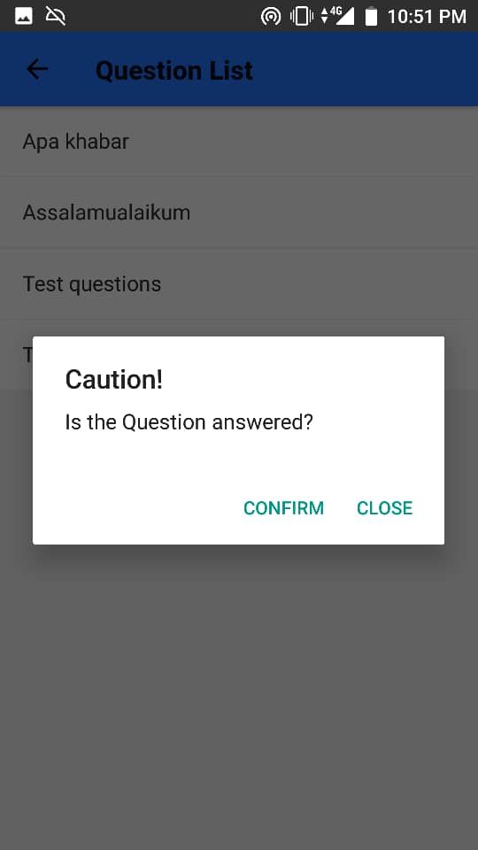

    
# Project Title : Masjid2U
# Group Members: Brotherhud
- Anwar Ikhlas (1611959)
- Sallehudin Ali (1617315)
- Farhan Hatta (1114127)
- Muhammad Fakhru Naim bin Muhad(1416753)
# 1.1 Introduction
   We plan to develop an app that specifically design for masjid use. This app will help masjid committee to promote and handle their event or talk that held there easier and more efficient. Two main function of this app are the question and answer function and display announcement for the masjid. Question and answer function will help the committee of the masjid having question and answer session more efficient and faster by using this app. Besides, the announcement function for displaying any announcement by the masjid’s committee.
   
# 1.2 Problem Description
- Masjid do not have any specific platform or any apps that can help ustaz or ustazah for question and answer sessions.  

- 1.2.1 Background
- In traditional ways, question and answer session be held using microphone or using paper if they want to ask question. This way doesn’t give an equal opportunity in asking the questions, especially for introvert person. To this kind of person, they need to organize their word well and it is hard for them to do it when people looking at them. So, they cannot deliver their question well.
- 1.2.2 Problem statement
-Using paper is one of the solutions, but percentage of peoples nowadays carry their smartphone is higher than peoples who brings paper anyway they go. Sometimes they do not have a piece of paper and a pen to write down their question. There are some apps that may be use, but that apps are seem complicated and complex for some novice user such as old people, people who has low computer background.

- List of Problem:
1.	People difficult to ask question using microphone or using paper. Maybe the microphone far from them or they do not have paper at that time to right their question.
2.	Application already in market mostly in paid version, complicated and complex for novice user.
3.	Does not have any specific application yet for masjid.

# 1.3 Project objective
-This project is meant to develop an application that can solve the several problems and can automate some of traditional ways, and make question and answer process faster and easier. The objectives of this application are:
1.	To help introvert people ask questions easier.
2.	To make question and answer session in masjid more efficient and faster.
3.	To develop a specific application or platform for masjid use.
4.	To ease novice user using computer technology in their life.
5.	To help ustaz or ustazah to receive question from audience easier and store it safely
6.	To help place their announcement easier and attract more people to view the announcement.

# 1.4 Project scope
- 1.4.1 Scope
- The goal of our application is to help both party between masjid’s community and public. This application been developed with intention to make question and answer session in masjid more efficient and convenient. Also, to implement IT technologies in masjid environment and take benefit from it. Transform the traditional way into automated ways. Besides, this application may help masjid’s community to place and spread their announcement more specific, faster and easier. This application expected to be finish by the end of December 2018. 

- 1.4.2 Targeted Users
- •	This application has two targeted users in which, the first targeted user is the Muslims community in general while the second targeted user is the masjid’s community. In early development of the application, we target only one masjid and to plan expend the scope later. 
- 1.4.3 Project Deliverables:
1.  Scope statement
2.  Progress report
3.  Meeting notes
4.  Finalized Project

# 1.5 Constraints
Basically, we will encounter problems of how to put the right information of the masjid. Then we will be having hard time to connect our app to the GPS system. Time and skill that we have also becomes part of our constraint. Due to that constraint, we eliminate the gps function for locating all nearby masjid and just focus on a masjid only.
# 1.6 Project Stages
During the development of the project, there are several stages that are required to be completed before proceding to the next stage. In the design phase, the layout of the application will first be designed using sketches to get basic understanding of how the application will look like. Next, we can proceed to the development phase where 2 major milestones are carried out in parallel, the coding of the app layout and the programming of the functions of the app. This is achieved by assigning the task to pairs;one pair of team members design the layout while the other pair code the functions. The progress of the project can be tracked through the Gantt chart.

# 1.7 Significance of Project
For the committee of the masjid, it is easier for them to promote all the lectures and programs. For the public, the apps will help them to view and read the announcement by the masjid and the main objective is to help them held question and answer session with ease and convenient.

# 1.8 Product
-1.8.1 Database table
- 
- 
- 
- 

-1.8.2 Entity Relationship Diagram
-

-1.8.3 Screenshoot of the Application
-
-
-
-
-
-
-
-
-
-

# 1.9 Summary 
 - Masjid2U application is a mobile application which is specifically design for masjid use. This application is developed on order to help Muslim community gain more knowledge by providing specific application which can help them to ask question during religious talk in masjid. This application is meant to make masjid to post their announcement in specific place and easier.

